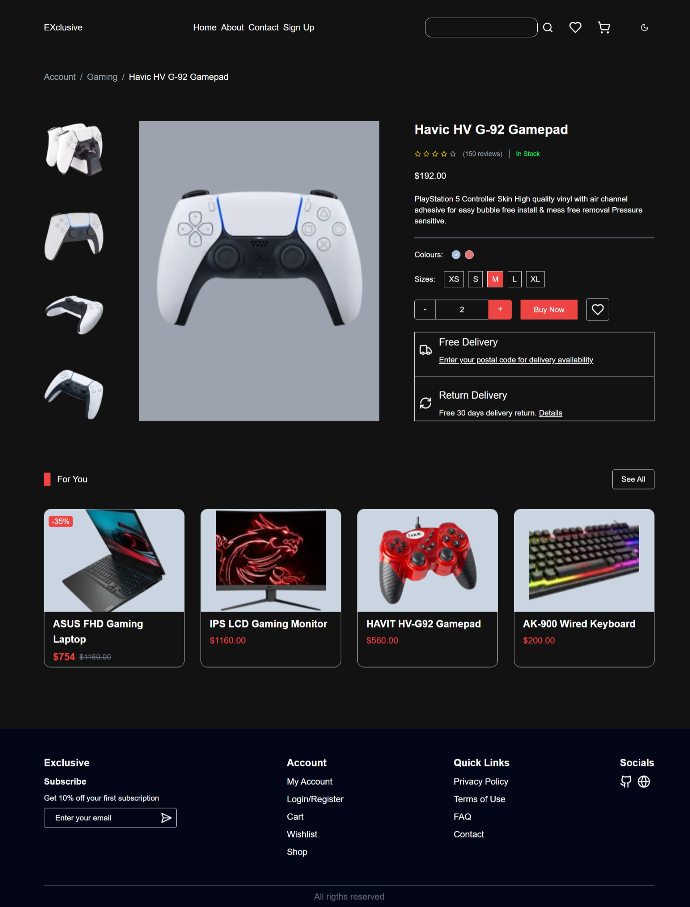

# E-Commerce website

A user-frindely e-commerce website, made using figma design from the Figma Community by [MD Rimel](https://www.figma.com/community/file/1219312065205187851/full-e-commerce-website-ui-ux-design)

## Demo

Live Preview: [Live](https://)




## Technologies

- NextJs
- TailwindCSS
- Shadcn

## Installation and Setup

### Prerequisites

- Node.js, npm.

### Steps to Install

1. Clone the repository:

   ```bash
   git clone https://github.com/Egnoel/dapp_ecommerce
   ```

2. Navigate to the project directory:

   ```bash
   cd project-name
   ```

3. Install dependencies:

   ```bash
   npm install
   ```

4. Run the development server:

   ```bash
   npm run dev
   ```

5. Open the app in your browser:

   ```bash
   http://localhost:3000
   ```

## Future Enhancements

- Interactive FUnctionalities.
- Backend and Smart contract support

## Contributing

Instructions for contributing to the project.

1. Fork the repository.
2. Create a feature branch.
3. Commit your changes.
4. Push the branch and create a pull request.

## License

This project is licensed under the MIT License - see the [LICENSE](LICENSE) file for details.

## Contact

- **Email**: egnoel@hotmail.com
- **LinkedIn**: [@egnoel-neto](https://www.linkedin.com/in/egnoel-neto/)
